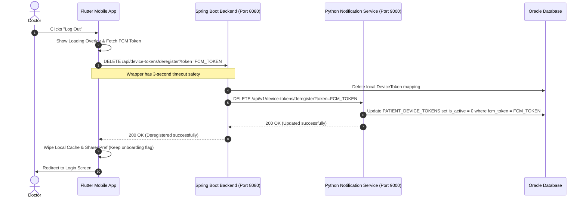

# Push Notification Token Deactivation & Sync Engine Implementation Walkthrough

This document outlines the complete technical implementation designed to prevent push notification leaks on shared mobile devices in the **Teeth Management System**. 

---

## 1. Problem Overview

In a medical clinic environment, a single mobile device might be shared:
1. A doctor logs in, receives their push notifications via an FCM (Firebase Cloud Messaging) token linked to their account.
2. The doctor logs out.
3. Another person (e.g., a patient using the clinic's device as a guest, or another doctor) books or uses the app on that same device.
4. If a patient books an appointment with the original doctor, a push notification was previously sent to that device, exposing private patient data to the logged-out doctor or a random patient who is currently using the device.

### Solution Requirements
* **Token Deactivation**: Upon logout, the doctor's active FCM device token must be marked as inactive (`is_active = False` / `0` in Oracle database) so no notifications can be pushed to that device.
* **Failure Redirection / Logging**: Any notifications queued for that doctor while their device is inactive will fail delivery and go into `FAILED` status, preventing leakage.
* **Missed Notification Sync Engine**: When the doctor logs back in, their token is reactivated (`is_active = True`). This registration automatically fires the sync engine, which pulls all of that doctor's `FAILED` notifications from the queue, changes their status back to `PENDING`, and resets the retry count to `0` to instantly redeliver them as push notifications on login.
* **No Impact on Guest Patients**: Guest patients never log in or register accounts, so their basic push token setups remain untouched and unhampered.

---

## 2. Core Implementation Architecture

The flow bridges three separate stack components:

---

## 3. Layer-by-Layer Code Changes

### A. Python Notification Microservice (`Notification/main.py`)

1. **Token De-registration Endpoint (`DELETE /api/v1/device-tokens/deregister`)**:
   * Resolves the token from request parameters.
   * Finds matching records in `PATIENT_DEVICE_TOKENS` and sets `is_active = False` (`0` in Oracle database) and updates `last_used_at`.
   * Safely commits transactions and logs the count of updated rows.

2. **Missed Notification Sync Engine (`POST /api/v1/device-tokens/register`)**:
   * Upon successful token registration or reactivation on login, the sync engine queries all notifications in `NOTIFICATION_QUEUE` under that user's ID with `status = 'FAILED'`.
   * Resets status of these notifications back to `PENDING` and resets `retry_count` to `0`.
   * This triggers immediate retry attempts by the background notification scheduler, delivering missed notifications immediately to the logged-in doctor.

---

### B. Spring Boot Java Backend

1. **Database Repository (`DeviceTokenRepo.java`)**:
   * Declared `void deleteByToken(String token)` to allow backend removal of local session-to-token mappings.

2. **Service Interface & Implementation (`DeviceTokenServiceImpl.java`)**:
   * Added transaction-wrapped `@Transactional public void deleteToken(String token)` which delegates to the JPA repository.

3. **HTTP Client Proxy (`NotificationClientServiceImpl.java`)**:
   * Added `public Map<String, Object> deregisterToken(String token)` method.
   * Utilizes `restTemplate.exchange()` to dispatch a HTTP `DELETE` call to the Python microservice's de-registration URL (`/api/v1/device-tokens/deregister?token={token}`).

4. **REST Controller (`DeviceTokenController.java`)**:
   * Exposed `@DeleteMapping("/deregister")` mapping to receive the de-registration call from the mobile app.
   * Looks up the authenticated doctor's context, removes their local token mapping, and relays the de-registration command to the Python microservice.

---

### C. Flutter Mobile Client

1. **API Endpoint Constants (`api_constants.dart`)**:
   * Added `static const String deregisterDeviceToken = '/api/device-tokens/deregister';` mapping to the Java backend route structure.

2. **Data Repository Layer (`notification_repo.dart`)**:
   * Declared and implemented `Future<bool> deregisterDeviceToken({required String fcmToken})` within the notification repository.
   * Packages the FCM token as a query parameter (`?token=$fcmToken`) and uses `ApiService.delete` to dispatch the request.

3. **Drawer Menu UI Logout Logic (`doctor_drawer_screen.dart`)**:
   * Refactored the "Log Out" tap handler into a fully asynchronous operation.
   * Pops the confirmation modal and immediately displays a non-dismissible loading indicator (`CircularProgressIndicator`).
   * Fetches the active `fcmToken` from secure preferences and fires `deregisterDeviceToken`.
   * **Timeout Protection**: The network call is wrapped in a `.timeout(const Duration(seconds: 3))` block. If the network is poor or offline, it safely times out in 3 seconds to avoid blocking the doctor from logging out.
   * Wipes all secure credentials, authentication tokens, and user cache values (`SharedPrefHelper.clearAllData()`, `clearAllSecuredData()`), while preserving the onboarding indicator (`has_seen_onboarding = true`).
   * Dismisses the loading dialog and executes a clean route redirection back to the login screen (`LoginScreen`).

---

## 4. Verification and Security Validation Plan

### Scenario 1: Doctor Logout & Deactivation
* **Action**: Doctor taps "Log Out" in the application's drawer.
* **Observed UI Behavior**: Loader screen appears, clears in <= 3 seconds, and securely returns user to the Login screen.
* **Backend Database Result**: `is_active` for that doctor's device token in `PATIENT_DEVICE_TOKENS` is updated to `0`.

### Scenario 2: notification delivery blocks on logged-out state
* **Action**: While the doctor is logged out, a patient books an appointment with that doctor.
* **Scheduler Execution**: The notification system checks `is_active` for the target doctor's token, finds it is `0`, fails to push, and marks the notification status as `FAILED`.
* **Security Validation**: **No notification leaks** to the mobile handset. The device remains clean of any private doctor-centric alerts.

### Scenario 3: Login & Reactivation (Missed Notification Sync Engine)
* **Action**: The doctor logs back in on the mobile application.
* **Scheduler Execution**: The login flow triggers `/api/v1/device-tokens/register`, which turns `is_active` back to `1`.
* **Sync Engine Trigger**: The registration endpoint automatically identifies all `FAILED` notifications for that user ID, marks them back to `PENDING` and resets retries to `0`.
* **Observed UI Behavior**: Instantly upon logging in, the doctor receives high-priority push notifications for all bookings that were requested during their logged-out state.
